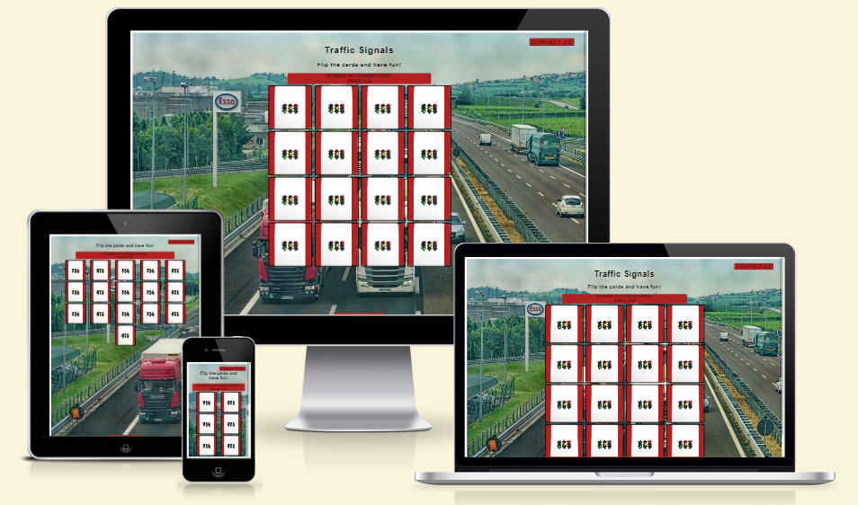
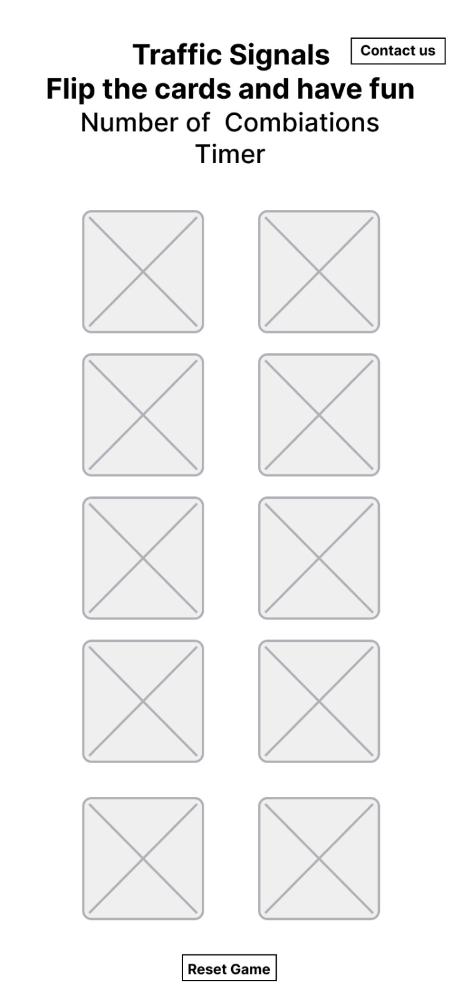
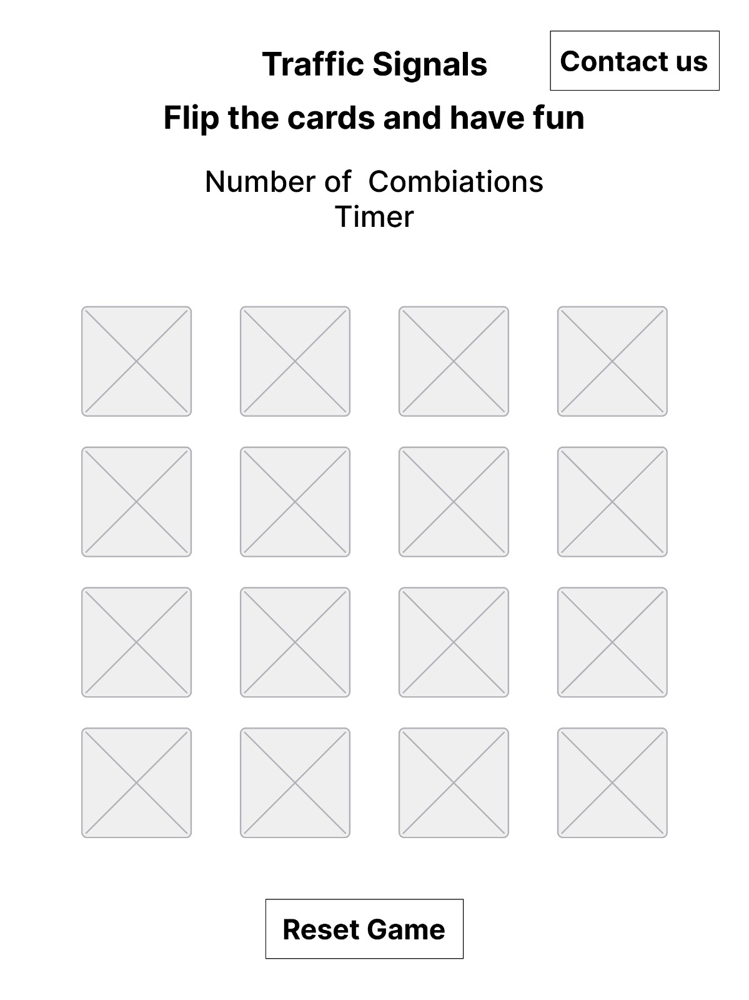
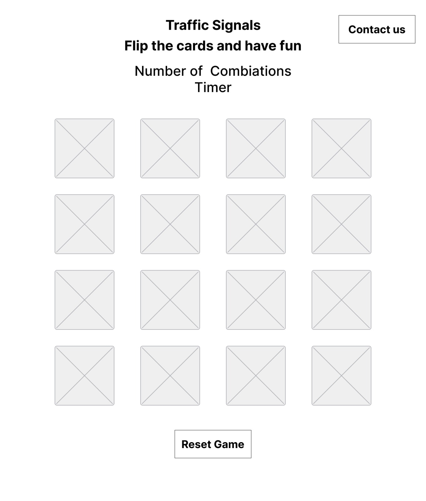

# Traffic Signs

Traffic Signs is a basic card matching game that tests players' visual memory and familiarity with traffic signs. It's a quick and easy method for players to pass the time and have fun.

The game contains a table with 16 cards. The objective of the game is to try to find the combination of cards, there will be a scoreboard that shows the number of combinations found, there will also be a timer counting down the game time. Try to memorize as much as you can. Observe the card presented and memorize the location of each traffic sign.

Once every combination has been discovered, an alert detailing the time and the quantity of combinations detected will be shown to you.

# Rules of the Game:

You will start by turning over a card
- If the next card you turn over is the same as the first, these cards will be disabled
- If the next card you turn over is not the same as the first, the cards will be turned back
- The game continues until you match all the cards on the board.
- You will get an alert with the timer and the total number of combinations made once you have found them all.

Visit the deployed website [here](https://joelinealves.github.io/traffic-signs/).

## Table of Contents

- [Trafic Signs](#trafic-signs)
  - [Table of Contents](#table-of-contents)
  - [User Experience (UX)](#user-experience-ux)
    - [Project Goals](#project-goals)
    - [User Stories](#user-stories)
    - [Color Scheme](#color-scheme)
    - [Typography](#typography)
    - [Wireframes](#wireframes)
  - [Features](#features)
    - [Additional features to be implemented](#additional-features-to-be-implemented)
    - [General](#general)
    - [Home Page](#home-page)
  - [Technologies Used](#technologies-used)
    - [Languages Used](#languages-used)
    - [Frameworks, Libraries and Programs Used](#frameworks-libraries-and-programs-used)
  - [Testing](#testing)
    - [Testing User Stories](#testing-user-stories)
    - [Example message received using template fields in Email JS](#example-message-received-using-template-fields-in-email-js)
    - [Code Validation](#code-validation)
    - [Accessibility](#accessibility)
    - [Tools Testing](#tools-testing)
    - [Automated Testing (TDD)](#manual-testing-(tdd))
    - [Manual Testing (BDD)](#manual-testing-(bdd))
  - [Finished Product](#finished-product)
  - [Deployment](#deployment)
    - [GitHub Pages](#github-pages)
    - [Forking the GitHub Repository](#forking-the-github-repository)
  - [Credits](#credits)
    - [Content](#content)
    - [Media](#media)
    - [Code](#code)
  - [Acknowledgements](#acknowledgements)

***

## User Experience (UX)

### Project Goals

The main objective of this project is to provide our target audience with an integrated, simplified and appealing user experience.
Our goal is to provide an easy-to-use application that meets all user needs.

- Increase user interest in understanding and knowing how to differentiate different traffic signs

- Provide the user with useful in-game tools to make the game more accessible.

- Give users the opportunity to learn and familiarize themselves with traffic signs.

-Give users the opportunity to contact the game developer if they have any questions.

### User Stories

- As a user, i want to have fun playing the game.

- As a user, i want the game to be instructive and graphically appealing..

- As a user, I want to develop memory and concentration skills.

- As a user, I want you to count the score of the combinations found.

- As a user, I want to be able to restart the game.

- As a user, I want to be able to get in touch with the developers of future games.

- As a user, I want to be able to browse the website on all devices (mobile, tablet, desktop).

- As a user, I want the card orders to be randomly generated when i restart the game.

### Color Scheme

The site's colors are FireBrick in rgb format rgb(178, 34, 34) for the background of the scoring time, number of combinations, on the buttons and also as the background of the cards, also used in modal form, white also in rgb format rgb(255, 255, 255) with the purpose of focusing on the buttons, used in the modal form and also part of the card's background design.
Lastly, the titles above the card grid, buttons, card border, scoring time, and number of combinations are all black, similarly formatted as rgb(0, 0, 0). These colors were selected for excellent readability and user perception, as well as attracting more attention from website visitors.

### Typography

The main font used on the site is Poppins, with Sans Serif as a fallback font if Poppins is not importing correctly. I decided to use just one font.

### Wireframes

[Figma](https://www.figma.com/) has been used to showcase the appearance of the site and display the placement of the different elements whitin the pages.

I am familiar with Figma so I had no problems building my wireframes.

Mobile 

Small-Screen 

Desktop Wireframe 

[Back to top ⇧](#travel-island)

### Features

- A board with 16 cards that can be turned over by clicking on up to two cards at the same time, If the cards do not match, they will be turned over again.

- The cards become disabled and cannot be selected again if two of the selected cards match.

- A score timer is included in the game to keep track of the amount of time spent playing and the total number of combinations made.

- The option to restart the game.

- The ability to send comments for improvements and future advancements to the game creator through message.

- Work in various browsers on desktop and mobile screens.

- A shuffled card display at reset.

### Additional features to be implemented

- Add a 404 page for users who link to a non-existent page or resource.
- Add an incorrect combination counter.
